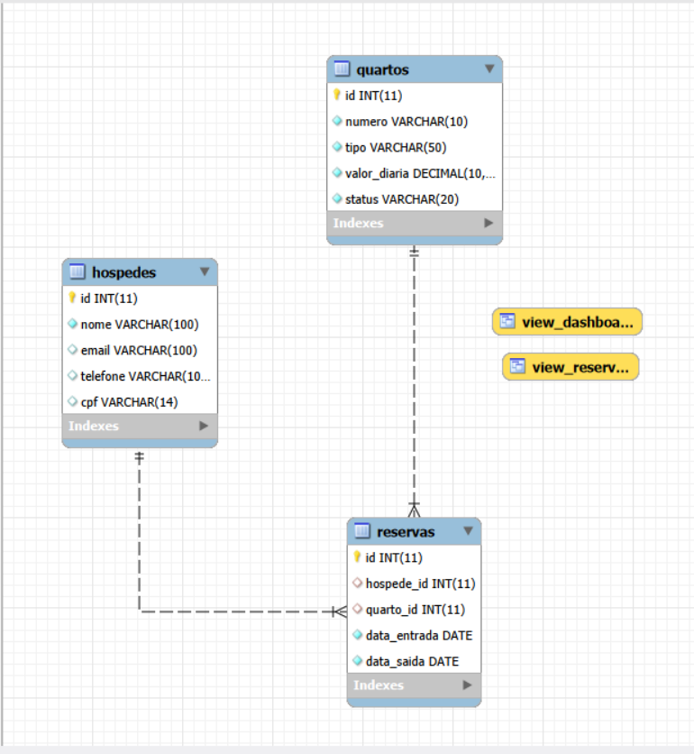

# Sistema Web de Gestão Hoteleira

## 📌 Descrição do Projeto

O **Sistema Web de Gestão Hoteleira** é uma aplicação web desenvolvida para facilitar o gerenciamento de hóspedes, quartos e reservas de um hotel de forma simples, organizada e centralizada.

O objetivo do sistema é permitir o cadastro, consulta, edição, visualização e exclusão de registros relacionados à operação hoteleira, reduzindo o uso de planilhas ou anotações manuais e tornando a administração mais prática.

O projeto utiliza:

- **Python** como linguagem principal do backend
- **FastAPI** para criação das rotas e regras de aplicação
- **Jinja2** para renderização das páginas HTML no servidor
- **MySQL** como banco de dados relacional
- **HTML, CSS e JavaScript** para a camada de interface
- **MVC (Model, View, Controller)** para organizar a aplicação em camadas

## 🖼️ Imagens do Projeto

### Logo


### Modelo do script do banco



### Arquitetura MVC

A aplicação segue a arquitetura **MVC** para manter o código mais limpo e fácil de manter:

- **Model**: concentra o acesso ao banco de dados, consultas SQL e regras de persistência.
- **View**: representa os templates Jinja2 responsáveis pela interface exibida ao usuário.
- **Controller**: fica no FastAPI, recebendo as requisições, processando os dados e retornando as respostas.

### Funcionalidades principais

- Dashboard com indicadores do sistema
- Cadastro de hóspedes
- Listagem de hóspedes
- Edição e exclusão de hóspedes
- Cadastro de quartos
- Listagem de quartos
- Edição e exclusão de quartos
- Cadastro de reservas
- Listagem de reservas
- Visualização de reservas por hóspede
- Integração com views do MySQL para relatórios e consultas agregadas

## 🛠️ Tecnologias Utilizadas

- Python
- FastAPI
- Jinja2
- MySQL
- HTML
- CSS
- JavaScript
- Uvicorn
- MySQL Connector Python
- Arquitetura MVC

## ⚙️ Instruções de Instalação

### 1. Clone o repositório

```bash
git clone https://github.com/grupo1top/gestaoweb-hotelaria
cd gestaoweb-hotelaria
```

### 2. Crie e ative um ambiente virtual

No Windows:

```bash
python -m venv venv
venv\Scripts\activate
```

No Linux ou macOS:

```bash
python3 -m venv venv
source venv/bin/activate
```

### 3. Instale as dependências

```bash
pip install -r requirements.txt
```

### 4. Configure o banco de dados MySQL

Crie o banco e as tabelas utilizando o script disponível em [sql/script.sql](sql/script.sql).

Esse arquivo cria:

- O banco de dados `hotelaria`
- As tabelas `hospedes`, `quartos` e `reservas`
- As views `view_reservas` e `view_dashboard`
- Dados iniciais para testes

### 5. Ajuste as credenciais do banco

Se necessário, altere as configurações de conexão em [dao.py](dao.py) para apontar para o seu ambiente local de MySQL.

### 6. Execute a aplicação

```bash
uvicorn app:app --reload
```

### 7. Acesse no navegador

Após iniciar o servidor, abra:

```bash
http://127.0.0.1:8000
```

## 📁 Estrutura do Projeto

```bash
gestaoweb-hotelaria/
├── app.py
├── dao.py
├── model.py
├── requirements.txt
├── README.md
├── sql/
│   └── script.sql
├── static/
│   ├── css/
│   │   └── style.css
│   ├── img/
│   └── js/
└── templates/
    ├── index.html
    ├── hospedes.html
    ├── quartos.html
    ├── reservas.html
    ├── view_reserva.html
    ├── add_hospede.html
    ├── edit_hospede.html
    ├── add_quarto.html
    ├── edit_quarto.html
    ├── add_reserva.html
    └── edit_reserva.html
```

## 🔎 Funcionalidades por Módulo

### Hóspedes

- Listagem de hóspedes cadastrados
- Cadastro de novos hóspedes
- Atualização de dados existentes
- Exclusão de registros

### Quartos

- Listagem de quartos cadastrados
- Cadastro de novos quartos
- Atualização de informações do quarto
- Exclusão de registros

### Reservas

- Listagem geral de reservas
- Cadastro de reservas
- Edição e exclusão de reservas
- Visualização detalhada de reservas por hóspede

## 🚀 Observações de Uso

- O projeto foi estruturado para funcionar com renderização de páginas no servidor, usando FastAPI e Jinja2.
- As consultas ao banco são feitas por meio de funções separadas na camada de modelo.
- As views do MySQL são usadas para consolidar dados do dashboard e da visualização de reservas.
- Para funcionamento correto, verifique se o MySQL está ativo e se o banco `hotelaria` foi criado antes de iniciar a aplicação.

